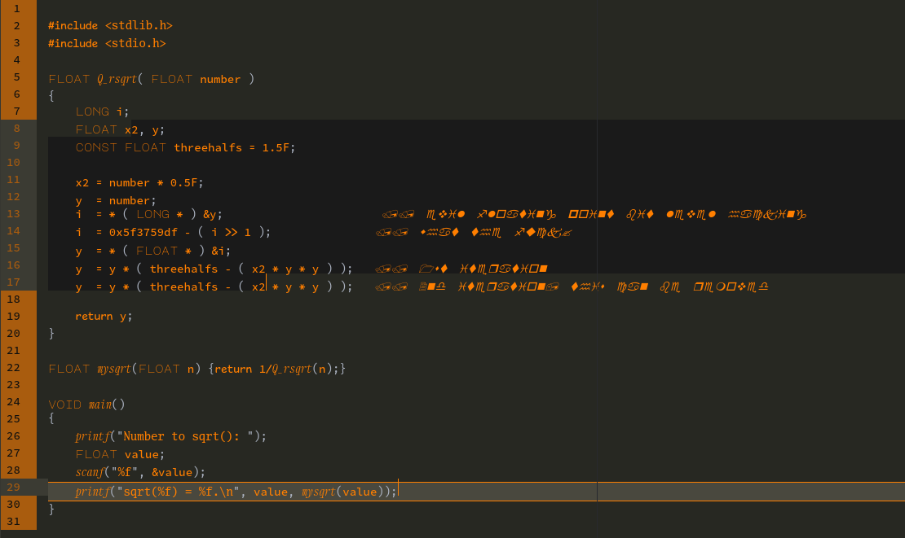

# zeus-syntax theme
*The perfect syntax theme for esoteric codenights!*

## Features
 - Almost everything is in the so-called Zeus orange (#ff7f00).  
 - The background for selected text is darker than the rest.  
 - Syntax highlighting uses different fonts, no colors: Comic Mono (monospaced Comic Sans), Fira Mono, Go Mono, Major Mono, Xanh Mono Italic.  
 - Comments use the widely known Wingdings.

Why would you want anything else?

